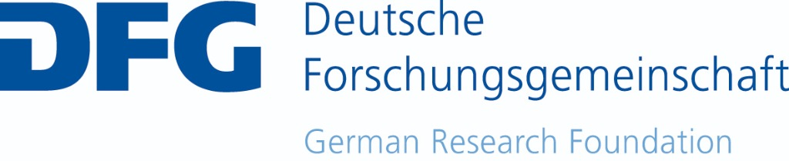

# HECTOR-Editor & Epochen-Vokabular

HECTOR-Editor is a lightweight, responsive desktop application built with Python and CustomTkinter for managing semantic SKOS vocabularies. Tailored for workflows in the Digital Humanities and archaeological data management, it allows researchers to easily build, edit, and serialize structured hierarchical concept schemes.

## ✨ Key Features (Editor)
* **SKOS Hierarchy Management:** Visually construct and manage `skos:Concept` hierarchies, top concepts, and automatically synchronized reciprocal `skos:broader` / `skos:narrower` relationships.
* **Multilingual Support:** Dynamic UI for managing `skos:prefLabel` and `skos:altLabel` across multiple language codes (DE/EN).
* **Polyhierarchical Support:** Concepts can be linked to multiple broader terms, allowing for an accurate representation of complex knowledge domains (e.g., Neuzeit centuries linked to both Neuzeit and the Chronological Grid).
* **Chronological Sorting:** The Treeview sorts all periods, millennia, centuries, halves, and quarters chronologically based on their German labels.
* **Data Quality & Integrity Checks:** Built-in tools to keep vocabularies clean and consistent:
    * **Reciprocal Synchronization:** A tool to automatically generate and synchronize missing `skos:narrower` relations from existing `skos:broader` relations (and vice-versa).
    * **Repair Missing URI Labels:** Generates english `skos:prefLabel` values dynamically from local parts of the concept URIs.
    * **Health Check validation:** Scans for orphan concepts missing both broader hierarchy and scheme top-concept linkage.
* **Authority File Integration:** Built-in asynchronous querying and exact matching (`skos:exactMatch`) for:
    * Wikidata API
    * Getty Art & Architecture Thesaurus (AAT)
    * Gemeinsame Normdaten (GND)
* **Turtle Serialization:** Native import and export of robust `.ttl` (Turtle) graphs using RDFLib.

---

## 🚀 Installation & Usage

1. Clone this repository:
   ```bash
   git clone https://github.com/bcdhbonn/hector-editor.git
   cd hector-editor
   ```
2. Install the required Python packages:
   ```bash
   pip install -r requirements.txt
   ```
3. Run the editor:
   ```bash
   python hector_editor.py
   ```

---

## 📂 Vocabulary Folder (`vocabularies/`)

This directory contains the semantic SKOS vocabularies, starting with the integrated epoch vocabulary **`vocabularies/hector_epochs/HECTOR_Epoch.ttl`**.

For details on the collection, directory structure, and sub-vocabularies, please refer to the main **[vocabularies/README.md](vocabularies/README.md)**.

---

## 🤝 Project Context & Funding
This tool was developed as part of the consortium **NFDI4Objects** (National Research Data Infrastructure for Objects of Material Cultural Heritage) within Taskarea 1.

NFDI4Objects is funded by the German Research Foundation (DFG) - Project number 441958489.

<p align="center">
  <br>
  <a href="https://www.nfdi4objects.net/">
    
  </a>
  &nbsp;&nbsp;&nbsp;&nbsp;&nbsp;&nbsp;&nbsp;&nbsp;&nbsp;&nbsp;&nbsp;&nbsp;&nbsp;&nbsp;&nbsp;&nbsp;&nbsp;&nbsp;
  <a href="https://www.dfg.de/">
    
  </a>
</p>

